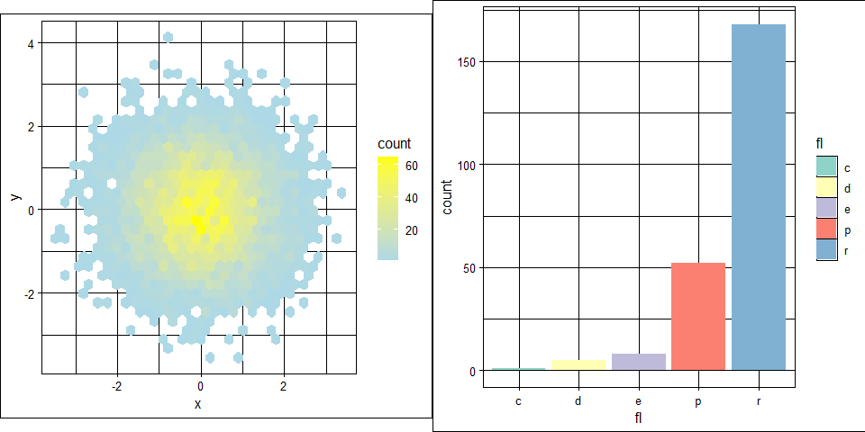
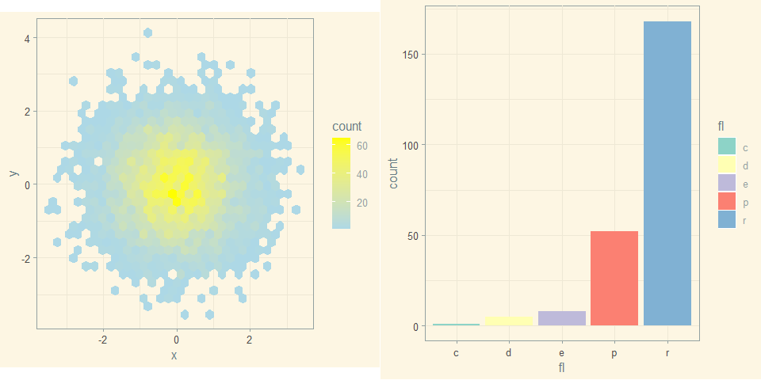

GGplot Themes
================
Joao Luiz D’andrea
2022-10-28

## List of themes from ggplot2 and ggthemes

``` r
library(hexbin)

data <- data.frame(x = rnorm(7000), y = rnorm(7000))
```

``` r
plot <- ggplot(data, aes(x = x, y = y)) +
  geom_hex() + coord_fixed() +
  scale_fill_gradient(low = "lightblue", high = "yellow")
```

``` r
plot2 <- ggplot(mpg, aes(fl)) +
     geom_bar(aes(fill = fl)) + 
    scale_fill_brewer(palette = "Set3")
```

``` r
a <- plot + theme_bw()
b <- plot2 + theme_bw()
grid.arrange(a, b, nrow = 1)
```

<!-- -->

``` r
a <- plot + theme_classic()
b <- plot2 + theme_classic()
grid.arrange(a, b, nrow = 1)
```

<!-- -->

``` r
a <- plot + theme_dark()
b <- plot2 + theme_dark()
grid.arrange(a, b, nrow = 1)
```

<!-- -->

``` r
a <- plot + theme_grau()
b <- plot2 + theme_grau()
grid.arrange(a, b, nrow = 1)
```

<!-- -->

``` r
a <- plot + theme_grey()
b <- plot2 + theme_grey()
grid.arrange(a, b, nrow = 1)
```

<!-- -->

``` r
a <- plot + theme_light()
b <- plot2 + theme_light()
grid.arrange(a, b, nrow = 1)
```

<!-- -->

``` r
a <- plot + theme_linedraw()
b <- plot2 + theme_linedraw()
grid.arrange(a, b, nrow = 1)
```

<!-- -->

``` r
a <- plot + theme_minimal()
b <- plot2 + theme_minimal()
grid.arrange(a, b, nrow = 1)
```

<!-- -->

``` r
a <- plot + theme_unikn()
b <- plot2 + theme_unikn()
grid.arrange(a, b, nrow = 1)
```

<!-- -->

``` r
a <- plot + theme_economist()
b <- plot2 + theme_economist()
grid.arrange(a, b, nrow = 1)
```

<!-- -->

``` r
a <- plot + theme_economist_white()
b <- plot2 + theme_economist_white()
grid.arrange(a, b, nrow = 1)
```

<!-- -->

``` r
a <- plot + theme_excel()
b <- plot2 + theme_excel()
grid.arrange(a, b, nrow = 1)
```

<!-- -->

``` r
a <- plot + theme_excel_new()
b <- plot2 + theme_excel_new()
grid.arrange(a, b, nrow = 1)
```

<!-- -->

``` r
a <- plot + theme_few()
b <- plot2 + theme_few()
grid.arrange(a, b, nrow = 1)
```

<!-- -->

``` r
a <- plot + theme_fivethirtyeight()
b <- plot2 + theme_fivethirtyeight()
grid.arrange(a, b, nrow = 1)
```

<!-- -->

``` r
a <- plot + theme_foundation()
b <- plot2 + theme_foundation()
grid.arrange(a, b, nrow = 1)
```

<!-- -->

``` r
a <- plot + theme_gdocs()
b <- plot2 + theme_gdocs()
grid.arrange(a, b, nrow = 1)
```

<!-- -->

``` r
a <- plot + theme_hc()
b <- plot2 + theme_hc()
grid.arrange(a, b, nrow = 1)
```

<!-- -->

``` r
a <- plot + theme_igray()
b <- plot2 + theme_igray()
grid.arrange(a, b, nrow = 1)
```

<!-- -->

``` r
a <- plot + theme_map()
b <- plot2 + theme_map()
grid.arrange(a, b, nrow = 1)
```

<!-- -->

``` r
a <- plot + theme_pander()
b <- plot2 + theme_pander()
grid.arrange(a, b, nrow = 1)
```

<!-- -->

``` r
a <- plot + theme_par()
b <- plot2 + theme_par()
grid.arrange(a, b, nrow = 1)
```

<!-- -->

``` r
a <- plot + theme_get()
b <- plot2 + theme_get()
grid.arrange(a, b, nrow = 1)
```

<!-- -->

``` r
a <- plot + theme_solarized()
b <- plot2 + theme_solarized()
grid.arrange(a, b, nrow = 1)
```

<!-- -->

``` r
a <- plot + theme_solarized_2()
b <- plot2 + theme_solarized_2()
grid.arrange(a, b, nrow = 1)
```

<!-- -->

``` r
a <- plot + theme_solid()
b <- plot2 + theme_solid()
grid.arrange(a, b, nrow = 1)
```

<!-- -->

``` r
a <- plot + theme_stata()
b <- plot2 + theme_stata()
grid.arrange(a, b, nrow = 1)
```

<!-- -->

``` r
a <- plot + theme_test()
b <- plot2 + theme_test()
grid.arrange(a, b, nrow = 1)
```

<!-- -->

``` r
a <- plot + theme_tufte()
b <- plot2 + theme_tufte()
grid.arrange(a, b, nrow = 1)
```

<!-- -->

``` r
a <- plot + theme_void()
b <- plot2 + theme_void()
grid.arrange(a, b, nrow = 1)
```

<!-- -->

``` r
a <- plot + theme_wsj()
b <- plot2 + theme_wsj()
grid.arrange(a, b, nrow = 1)
```

<!-- -->

## Building your own theme

``` r
# Setting a font to use in the charts
windowsFonts(A = windowsFont("Times New Roman"))
```

## Theme Legends

``` r
# Defining chart legends
l <- labs(title = "Here is the Title",
          subtitle = "Here is the Sub-Title",
          caption = "Here is the Caption",
          # tag = "tag",
          xlab = "My X-axis label",
          ylab = "My Y-axis label"
)
```

``` r
# Setting the theme

theme_set(
  theme_grey() +
    theme(
          plot.title = element_text(hjust = 0.5, face = "bold", family = "A" ),
          plot.title.position = ("plot"),
          plot.subtitle = element_text(color = "yellow", hjust = 0.5),
          plot.caption = element_text(color = "black", face = "italic", hjust = 0),
          plot.background = element_rect(fill = "green"),
          plot.margin = margin(0.5, 0.5, 0.5, 0.5, "cm"),
          # Panel Options
          panel.background = element_rect(fill = "lightBlue", colour = "White"),
          panel.border = element_rect(linetype = "dashed", fill = NA),
          panel.grid.major = element_line(colour = "Yellow"),
          panel.grid.major.y = element_blank(),
          panel.grid.minor.y = element_blank(),
          panel.ontop = FALSE,
          # Axis Options
          axis.line = element_line(size = 0.5, colour = "grey80", arrow = arrow()),
          axis.text = element_text(colour = "white", size = 20),
          axis.ticks = element_line(colour = "blue", size = 6),
          axis.title.y = element_text(size = rel(1), angle = 45),
          axis.ticks.length.y = unit(.25, "cm"),
          axis.ticks.length.x = unit(-.25, "cm"),
          axis.text.x = element_text(margin = margin(t = .3, unit = "cm")),
          # Legend options
          #legend.position = "none",
          #legend.justification = "top",
          #legend.position = "bottom",
          #legend.position = c(.95, .95),
          #legend.justification = c("right", "top"),
          #legend.box.just = "right",
          #legend.margin = margin(6, 6, 6, 6),
          #legend.box.background = element_rect(),
          #legend.box.margin = margin(6, 6, 6, 6),
          #legend.key = element_rect(fill = "white", colour = "black"),
          #legend.text = element_text(size = 8, colour = "red"),
          #legend.title = element_text(face = "bold"),
          # Strip options - Used for multiple panels
          strip.background = element_rect(colour = "black", fill = "yellow"),
          strip.text.x = element_text(colour = "black", face = "bold"),
          panel.spacing = unit(0.5, "lines")
    )
)
```

``` r
# Three basic graphs to test the theme

# Chart 1
ggplot(mtcars,aes(wt, mpg)) +
  geom_point() +
  l
```

<!-- -->

``` r
# Chart 2
ggplot(mtcars,aes(wt, mpg)) +
  geom_point(aes(colour = factor(cyl), shape = factor(vs))) +
  labs(
    x = "Weight (1000 lbs)",
    y = "Fuel economy (mpg)",
    colour = "Cylinders",
    shape = "Transmission"
  )
```

<!-- -->

``` r
# Chart 3
ggplot(mtcars,aes(wt, mpg)) +
  geom_point() +
  facet_wrap(~ cyl)
```

<!-- -->
